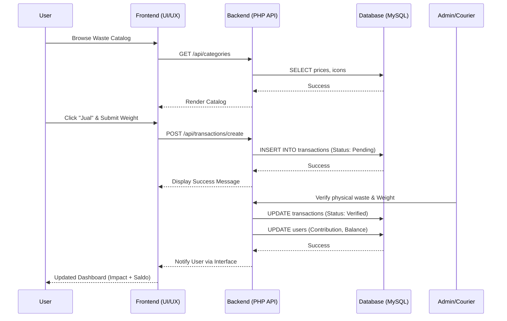

# PRD — Project Requirements Document: THE ORGANIC BREATH

## 1. Overview
**The Organic Breath** is a high-end, fullstack waste management portal designed to revolutionize the "Waste-to-Wealth" ecosystem. Unlike traditional recycling apps that feel industrial and transactional, The Organic Breath adopts a **"High-End Editorial"** approach, treating sustainability as a prestigious lifestyle contribution.

**Creative North Star: "The Living Archive"**
- **Aesthetic:** Breathable, sophisticated, deeply intentional.
- **UI Logic:** No solid 1px borders, tonal layering, glassmorphism, and intentional asymmetry.
- **Mission:** To empower users (Individu & Bisnis) to monetize inorganic waste while tracking their cumulative environmental impact in real-time.

---

## 2. Requirements

### 2.1 Functional Requirements (User)
- **Authentication:** Registration/Login with secure session management.
- **Dashboard:** Interactive summary of total waste contributed (kg), current balance (IDR), and Membership Tier (Bronze, Silver, Gold).
- **Marketplace (Beli Sampah):** Searchable catalog of waste types with real-time price-per-kilogram.
- **Waste Submission (Jual):** Multi-step form to select waste categories, specify weight/quantity, and submit for verification.
- **Services (Layanan):** Scheduling Pick-up service, booking industrial consultations, and composting workshops.
- **Profile:** Management of user data, transaction history, and redemption of "Saldo" into payouts.

### 2.2 Functional Requirements (Admin/Staff)
- **Transaction Verification:** Reviewing and approving user-submitted waste entries.
- **Catalog Management:** Updating prices and adding new waste categories.
- **Service Fulfillment:** Managing pick-up schedules and consulting requests.
- **User Management:** Overseeing user tiers and contribution logs.

### 2.3 Non-Functional Requirements
- **Performance:** Initial load time < 2s; smooth transitions (60fps) using Tailwind transitions.
- **Responsive:** Mobile-first design (optimized for PWA usage) with adaptive desktop layouts.
- **Security:** SQL Injection prevention, CSRF tokens for form submissions, and secure API endpoints.
- **Reliability:** Built for Shared Hosting stability (PHP 8.x + MySQL).

---

## 3. Core Features

### 3.1 Impact Tracking System
- Visualizes user contribution through a "Total Kontribusi" card with high-impact typography.
- Calculates environmental savings (e.g., CO2 reduction equivalents — optional enhancement).
- Rewards users with "Tier Gold" status for consistent high-volume contributions.

### 3.2 Waste Pricing Marketplace
- **Categories:**
  - **Plastik:** Botol PET Bening, Gelas Plastik, HDPE, etc.
  - **Kertas:** Kardus Bekas, Kertas HVS/A4, Koran, Duplex.
  - **Logam:** Aluminium Can, Besi Tebal, Tembaga, Kuningan.
  - **Elektronik/Kaca:** Special handling categories.
- Features real-time price indicators and "Popular" tags.

### 3.3 Layanan Tercepat (Quick Services)
- **Pick-up Service:** Logistical support for routine household waste collection.
- **Industrial Waste Consulting:** Expert guidance for corporate Zero Waste targets.
- **Composting Solutions:** Providing Bokashi systems and organic waste training.
- **Recycling Training:** Educational modules for economic waste processing.

### 3.4 Community Hub (Eksplorasi)
- **Agenda:** Local clean-up events (e.g., "Piknik Bersih Pantai").
- **Edukasi:** Blogs on understanding plastic codes and recycling techniques.
- **Lowongan Kerja:** Career opportunities in the green economy sector.

---

## 4. User Flow

### 4.1 Onboarding & Dashboard
1. User opens the portal and sees the Hero greeting ("Halo, [Name]!").
2. User views the Bento-style impact summary (Total Contribution, Saldo, Tier).
3. User explores "Layanan Tercepat" or navigation menu.

### 4.2 The "Jual Sampah" Transaction Flow
1. User navigates to the **jual** tab.
2. User searches or selects a waste category (e.g., "Botol PET Bening").
3. User clicks **"Jual"** and enters the estimated weight.
4. User selects "Pick-up" or "Drop-off" method.
5. System creates a `Pending` transaction log.
6. Admin/Courier verifies the physical waste -> updates weight -> updates status to `Verified`.
7. User's Dashboard reflects the new Balance and cumulative KG.

---

## 5. Architecture

The application follows a **Decoupled Architecture** suitable for Shared Hosting:

- **Presentation Layer (Frontend):**
  - **Framework:** Vanilla HTML5, Tailwind CSS 3.x.
  - **Rendering:** Server-Side Rendering (via PHP) with Client-Side interactivity (Vanilla JS).
  - **Assets:** Google Fonts (Plus Jakarta Sans, Manrope), Material Symbols (Outlined).

- **Logic Layer (Backend):**
  - **Environment:** PHP 8.1+
  - **Structure:** MVC-inspired Service Pattern.
  - **API:** RESTful endpoints for transaction and dashboard data.

- **Storage Layer (Database):**
  - **Type:** MySQL 8.x
  - **Handling:** PDO (PHP Data Objects) for secure database interactions.

---

## 6. Sequence Diagram (Waste Transaction Flow)

---

## 7. Database Schema

### 7.1 Users Table (`users`)
| Column | Type | Description |
| :--- | :--- | :--- |
| `id` | INT (PK) | Auto-increment primary key |
| `name` | VARCHAR(100) | Full name |
| `email` | VARCHAR(100) | Unique login email |
| `password` | VARCHAR(255) | Hashed password |
| `balance` | DECIMAL(15,2) | Current IDR balance |
| `total_kg` | DECIMAL(10,2) | Total lifetime contribution |
| `tier_id` | INT (FK) | Reference to `tiers.id` |
| `created_at` | TIMESTAMP | Member since |

### 7.2 Catalog Table (`waste_categories`)
| Column | Type | Description |
| :--- | :--- | :--- |
| `id` | INT (PK) | Category ID |
| `name` | VARCHAR(100) | Name (e.g., Botol PET) |
| `slug` | VARCHAR(100) | URL-friendly name |
| `category` | ENUM | Plastik, Kertas, Logam, etc. |
| `price_per_kg` | DECIMAL(10,2) | Current buying price |
| `icon` | VARCHAR(50) | Material Symbols icon name |
| `image_url` | TEXT | Display image reference |

### 7.3 Transactions Table (`transactions`)
| Column | Type | Description |
| :--- | :--- | :--- |
| `id` | INT (PK) | Transaction ID |
| `user_id` | INT (FK) | Reference to `users.id` |
| `cat_id` | INT (FK) | Reference to `waste_categories.id` |
| `weight_est` | DECIMAL(10,2) | User's estimation |
| `weight_actual`| DECIMAL(10,2) | Verified weight by Admin |
| `total_payout` | DECIMAL(15,2) | Calculated amount (kg * price) |
| `status` | ENUM | PENDING, VERIFIED, REJECTED |
| `created_at` | TIMESTAMP | Transaction timestamp |

---

## 8. Tech Stack

### 8.1 Frontend
- **HTML5/JS:** Semantic structure with Vanilla JS for DOM manipulation and API fetching.
- **Styling:** Tailwind CSS (via CDN for local dev, compiled for production) to implement the **"Organic Breath"** design tokens.
- **Typography:** *Plus Jakarta Sans* (Headlines) & *Manrope* (Body) via Google Fonts.
- **Icons:** Material Symbols Outlined.

### 8.2 Backend
- **Language:** PHP 8.x (Using native PDO for DB and structured routing).
- **Environment:** Compatible with Shared Hosting (Apache/.htaccess).
- **Security:** Argon2id for password hashing; `htmlspecialchars()` and prepared statements for data integrity.

### 8.3 Database & Deployment
- **Database:** MySQL 8.x (Innodb engine).
- **Deployment:** Git-based deployment or FTP sync to production server.
